# User Guide

The MITR AI platform helps you access data, run reports, search documents, and find links — all through natural language. This guide walks you through each surface of the platform with step-by-step flows.

## Quick Reference

| Flow                                                  | Surface   | What You'll Learn                                   |
| ----------------------------------------------------- | --------- | --------------------------------------------------- |
| [Flow 1](#flow-1-chat--ask-questions--get-answers)    | Chat      | Run queries, use filters, read results              |
| [Flow 2](#flow-2-chat--explore-your-data)             | Chat      | Follow-up chaining, ML analysis, anomaly detection  |
| [Flow 3](#flow-3-chat--export--cross-surface-actions) | Chat      | Export results, pin to dashboard, open in GridBoard |
| [Flow 4](#flow-4-dashboard--monitor-your-data)        | Dashboard | Add cards, configure views, search queries          |
| [Flow 5](#flow-5-gridboard--edit--analyze-data)       | GridBoard | Spreadsheet editing, toolbar, data operations       |
| [Flow 6](#flow-6-widget--embedded-chat)               | Widget    | Embedded chat on any web page                       |
| [Flow 7](#flow-7-admin--configure-the-platform)       | Admin     | Manage groups, anomaly detection, analytics         |

---

## Flow 1: Chat — Ask Questions & Get Answers

Learn how to ask the chatbot questions and get data results with tables and charts.

### Getting Started

When you open the Chat page, you'll see a welcome screen with quick-start options.

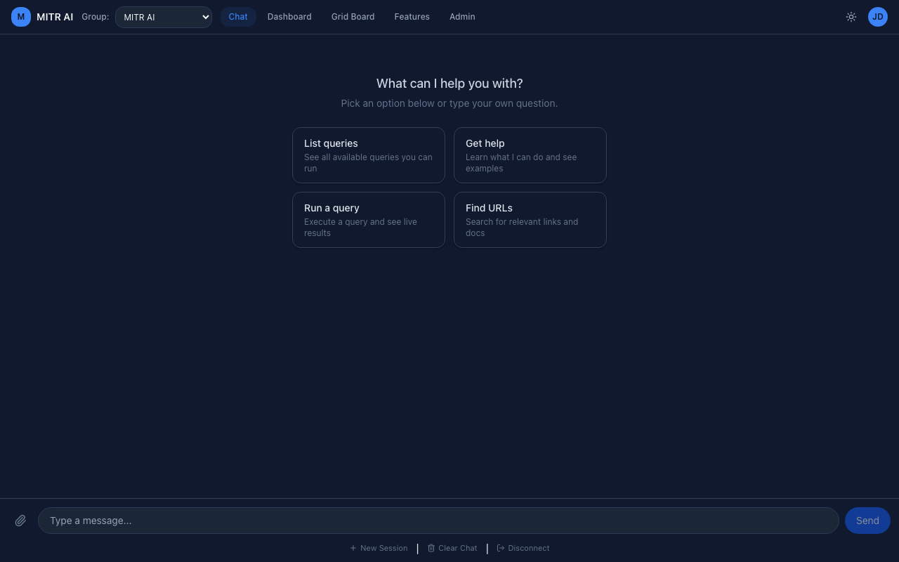

Just type what you need in plain English:

- "show me active users for this week"
- "what is the error rate?"
- "list all queries"

Or click one of the quick-start cards: **List queries**, **Get help**, **Run a query**, or **Find URLs**.

### Running a Query

Type the name of a query (or describe what you're looking for) and press Send.

**Examples:**

```
"run monthly_revenue"
"show me active users"
"execute error_rate"
```

If the query supports filters, a filter form appears where you can narrow results before running:

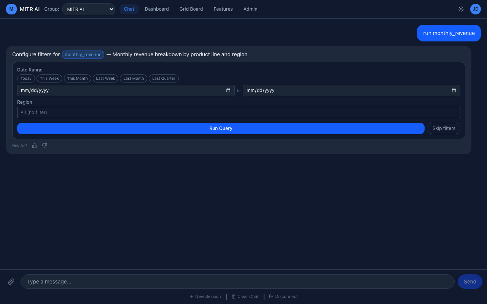

You can either fill in filters and click **Run Query**, or click **Skip filters** to run with no filters.

### Using Filters

Many queries support filters to narrow down results.

**Supported Filter Types:**

- **Time Period**: "this week", "last month", "this quarter", "today"
- **Region**: "US", "EU", "APAC"
- **Team**: "engineering", "sales", "marketing", "support"
- **Environment**: "production", "staging", "dev"

**Examples with inline filters:**

```
"run monthly_revenue for this month"
"show me active_users for last week"
"get error_rate in production"
"run monthly_revenue for this quarter in EU"
```

**SQL Database Filters** — add the filter name and value after the query name:

```
"run order_details status Completed"
"run employee_directory Department Engineering"
"run revenue_by_product Category Electronics"
```

### Reading Results

After a query runs, results appear as a table with an auto-generated chart below it.

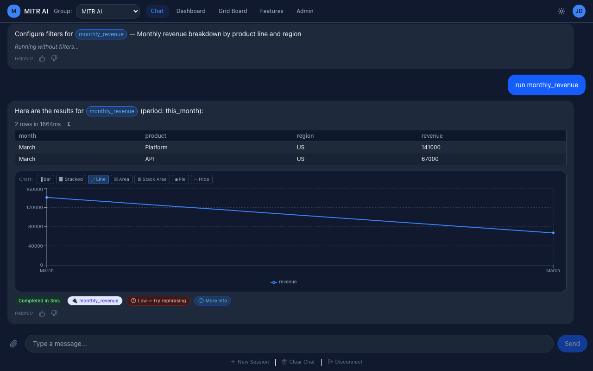

**Tables** — Scrollable, paginated tables. Large result sets are capped at 500 rows (total count shown).

**Charts** — Automatically displayed based on data patterns:

- **Line charts** for time-series data (dates + numbers)
- **Bar charts** for categorical comparisons
- **Pie charts** for small datasets with a single metric

You can switch chart types using the chart toolbar (Bar, Stacked, Line, Area, Stack Area, Pie, or Hide).

**Date Formatting** — Date values are automatically formatted:

- Date-only: `Jan 15, 2025`
- Date + time: `Jan 15, 2025, 2:30:00 PM`

### Query Types

| Type         | Description                                 | Examples                                                               |
| ------------ | ------------------------------------------- | ---------------------------------------------------------------------- |
| **API**      | Live data from backend APIs                 | `active_users`, `monthly_revenue`, `error_rate`                        |
| **Document** | Search internal documents                   | "search auth_spec for MFA", "run deployment_runbook"                   |
| **CSV**      | Analyze CSV files (auto-detects delimiters) | "run sales_data", "average resolution_hours in support_tickets"        |
| **XLSX**     | Excel files (multi-sheet auto-registered)   | "run employee_compensation", "average salary in employee_compensation" |
| **SQL**      | Direct database queries (MSSQL/Oracle)      | "run order_details", "run revenue_by_product"                          |
| **URL**      | Open external dashboards                    | "link for servicenow_dashboard"                                        |

### Listing & Searching Queries

Type "list queries" to see all available queries with descriptions and badges:

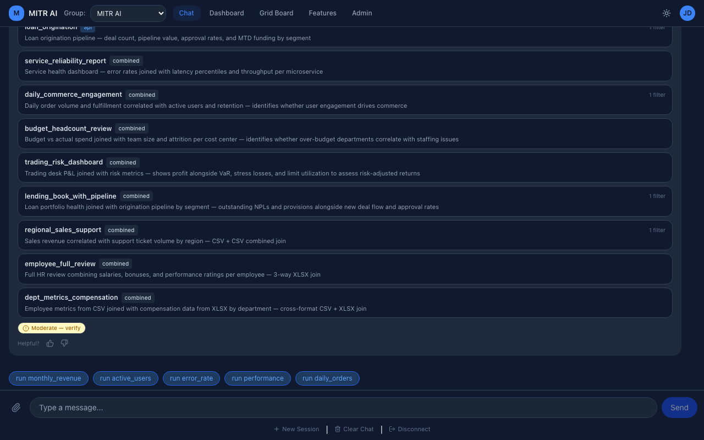

Click on any query card to run it directly.

**Semantic Search** — Describe what you're looking for instead of remembering exact names:

```
"show me revenue data"
"find something about user metrics"
"anything related to error rates"
```

### Getting Help

Type "help" to see what the chatbot can do, with example commands:

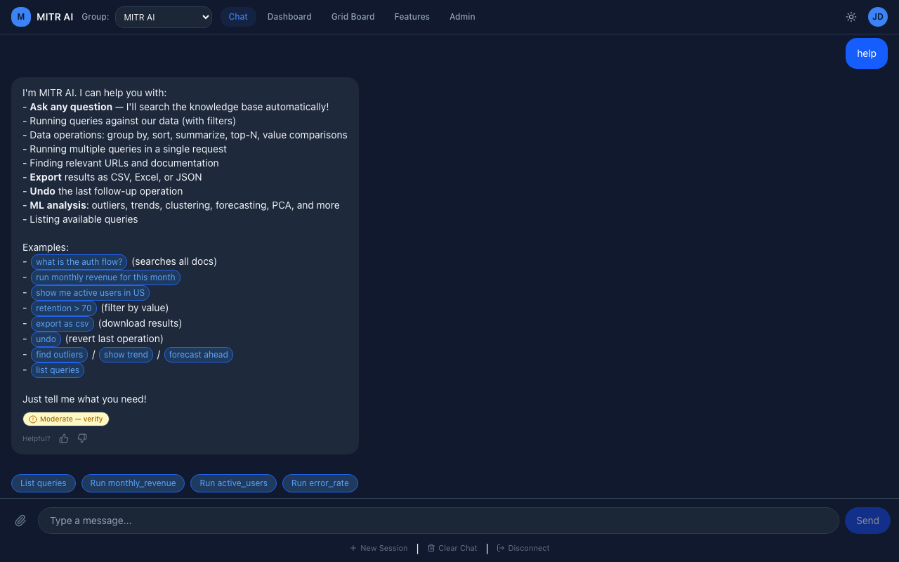

### Available Commands

| Command              | What It Does                     | Example                               |
| -------------------- | -------------------------------- | ------------------------------------- |
| **Run a query**      | Execute a data query             | "run monthly_revenue"                 |
| **List queries**     | See all available queries        | "list queries"                        |
| **Compare queries**  | Run multiple queries together    | "show me active_users and error_rate" |
| **Search queries**   | Find queries by natural language | "show me revenue data"                |
| **Search documents** | Find information in documents    | "search auth_spec for MFA"            |
| **Get a link**       | Open an external URL             | "link for servicenow_dashboard"       |
| **Get an estimate**  | See how long a query takes       | "how long will performance take?"     |
| **Export results**   | Download query results           | "export as CSV"                       |
| **Undo**             | Revert the last follow-up        | "undo" or "go back"                   |
| **Help**             | See what the chatbot can do      | "help"                                |

---

## Flow 2: Chat — Explore Your Data

Learn how to chain operations, run ML analysis, and detect anomalies on your query results.

### Follow-Up Chaining

After running a query, chain multiple follow-up operations to explore the data step by step. Each operation builds on the previous result.


**Example Chain:**

```
You: "run monthly_revenue"
Bot: [shows revenue table]

You: "group by region"
Bot: [grouped results with sum and count]

You: "sort by revenue desc"
Bot: [sorted grouped results]

You: "top 5"
Bot: [top 5 regions by revenue]
```

**Available Follow-Up Operations:**

| Operation       | Example                                              |
| --------------- | ---------------------------------------------------- |
| **Group by**    | "group by region", "group by status"                 |
| **Sort**        | "sort by revenue desc", "sort ascending"             |
| **Filter**      | "filter by region US", "only show completed"         |
| **Top N**       | "top 10", "show top 5"                               |
| **Aggregation** | "average revenue", "sum of orders", "count rows"     |
| **Summary**     | "summarize", "give me a summary"                     |
| **Data lookup** | "retention > 70", "show rows where status is active" |

### Undo Operations

Made a mistake in your chain? Say **"undo"** to revert the last step:

```
You: "undo"
Bot: Undid: "sort by revenue desc". Current chain: group by region
```

### Smart Suggestions

After each response, clickable suggestion chips appear below the results. These are ranked by relevance and capped at 5 chips.

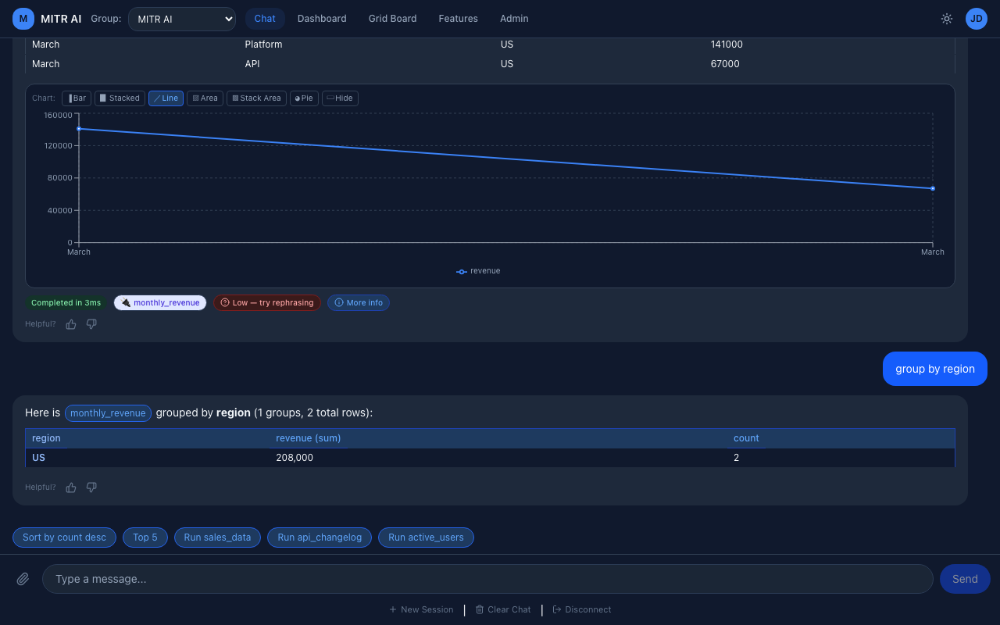

**How suggestions are generated:**

- **Anomaly-triggered** (highest priority): When unusual values are detected, suggestions like "Find outliers in revenue" appear
- **Analysis follow-ups**: After an analysis (e.g., correlation), the bot suggests logical next steps (e.g., "PCA analysis")
- **Chain-aware**: Based on your current chain, suggests the next logical operation (e.g., after "group by", suggests "Sort" or "Top 5")
- **ML recommendations**: Co-occurrence patterns, collaborative filtering, time patterns, and user clustering
- **Handler defaults**: Standard suggestions from the current operation

The system learns from your interactions — clicking a suggestion strengthens that signal, while rephrasing weakens it.

### Anomaly Detection

When query results contain unusual numeric patterns, the chatbot automatically flags them with badges:

- **Info** (blue badge): Mild deviation from expected values
- **Warning** (yellow badge): Values 2+ standard deviations from baseline
- **Critical** (red badge): Values 3+ standard deviations from baseline

**Detection Methods:**

1. **Statistical** — Z-score and IQR analysis against historical baselines
2. **Seasonal** — Day-of-week baselines (e.g., "revenue is always lower on weekends")
3. **Business Rules** — Admin-defined thresholds (e.g., "alert if error_rate > 5%")

Baselines are built automatically after 5+ executions of the same query. When anomalies are detected, smart suggestion chips prompt you to investigate.

### ML Analysis Commands

Run a query first, then ask for analysis on the results:

| Analysis          | Example               | What It Does                            |
| ----------------- | --------------------- | --------------------------------------- |
| **Profile**       | "profile columns"     | Column statistics, types, distributions |
| **Smart Summary** | "smart summary"       | AI-generated narrative summary          |
| **Correlation**   | "show correlations"   | Numeric column correlation matrix       |
| **Distribution**  | "show distribution"   | Value distribution across columns       |
| **Anomaly**       | "find outliers"       | Identifies unusual values               |
| **Trend**         | "show trend"          | Time-series trend detection             |
| **Duplicates**    | "find duplicates"     | Identifies duplicate rows               |
| **Missing Data**  | "show missing values" | Visualizes gaps in data                 |
| **Clustering**    | "cluster the data"    | K-means clustering                      |
| **Decision Tree** | "decision tree"       | Decision tree classification            |
| **Forecast**      | "forecast ahead"      | Time-series forecasting                 |
| **PCA**           | "PCA analysis"        | Dimensionality reduction                |
| **Full Report**   | "insight report"      | Combined multi-analysis report          |

After running an analysis, the bot suggests logical next steps (e.g., after correlation, it suggests PCA or clustering).

### Conversational Commands

The chatbot understands conversational responses:

- **Confirm**: "yes", "correct", "go ahead" — confirms a pending suggestion
- **Deny**: "no", "cancel", "never mind" — declines and offers alternatives
- **Clarify**: "what do you mean?", "explain" — the bot explains its last response

---

## Flow 3: Chat — Export & Cross-Surface Actions

Learn how to export data and move results between Chat, Dashboard, and GridBoard.

### Export Results

After running a query (with or without follow-ups), export the results:

| Format    | How to Ask                           |
| --------- | ------------------------------------ |
| **CSV**   | "export as CSV", "download CSV"      |
| **JSON**  | "export as JSON", "download as JSON" |
| **Excel** | "export as Excel", "download XLSX"   |

The export includes all rows and columns from the current result set, including any follow-up operations you've applied.

### Cross-Surface Action Buttons

When you run a query in Chat, action buttons appear below the results:

| Button                | What It Does                                                      |
| --------------------- | ----------------------------------------------------------------- |
| **Pin to Dashboard**  | Adds the query as a card on your Dashboard for ongoing monitoring |
| **Open in GridBoard** | Opens tabular results in GridBoard for spreadsheet-style editing  |
| **Export as CSV**     | Downloads the results as a CSV file                               |

These buttons appear automatically based on the result type — tabular data shows all three, while non-tabular results show only applicable actions.

### Multi-Query Comparison

Run two queries at once to see side-by-side results:

```
"compare error_rate and performance"
"show me active_users and customer_churn"
```

---

## Flow 4: Dashboard — Monitor Your Data

Learn how to create and manage dashboard cards for ongoing data monitoring.

### Dashboard Overview

The Dashboard shows query results as configurable cards with tables, charts, and inline actions.

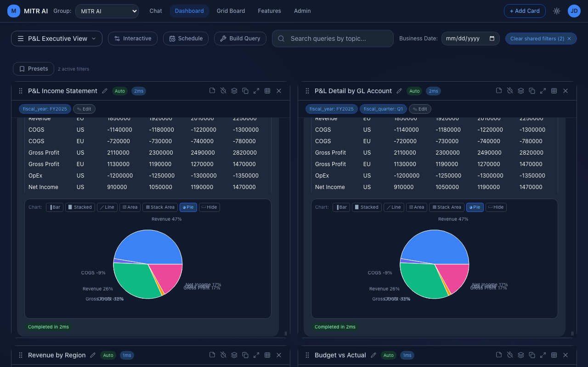

Each card shows:

- Query name with auto-refresh and timing badges
- Active filters as tags
- Data table with results
- Chart visualization (switchable: Bar, Stacked, Line, Area, Stack Area, Pie)
- Action bar: Refresh, Clear, Export, Local/Re-query, Open in Chat

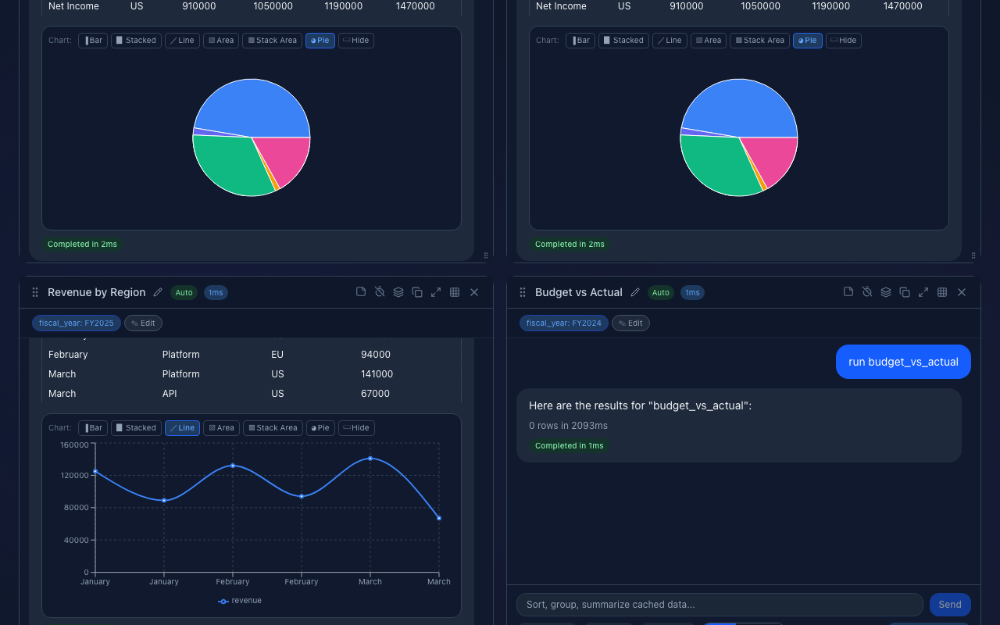

### Dashboard Selector & Presets

Use the dashboard selector dropdown (top-left) to switch between saved dashboard views. Click **Presets** to apply saved filter configurations.

Features in the top toolbar:

- **Interactive** mode toggle
- **Schedule** for automatic refreshes
- **Build Query** for custom queries

### Adding a Card

Click **+ Add Card** to add a new query card to your dashboard:

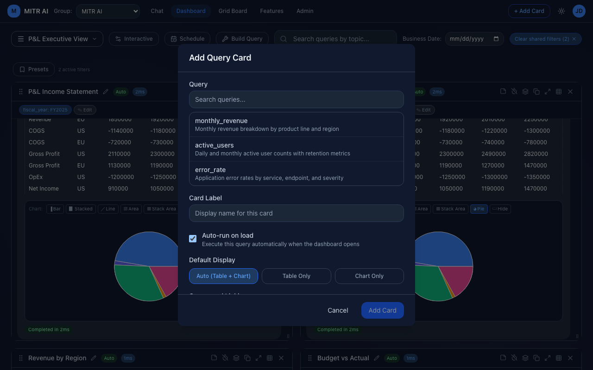

1. Search or select a query from the dropdown
2. Optionally set a custom **Card Label**
3. Toggle **Auto-run on load** to refresh automatically when the dashboard opens
4. Click **Add Card**

### Searching Queries

Use the search bar to find queries by topic. The search supports semantic/natural language:

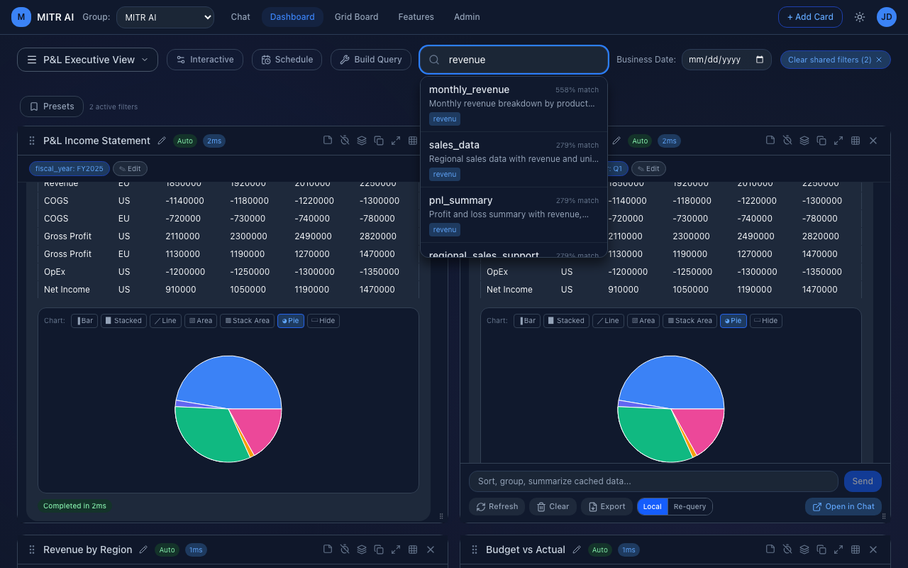

Type naturally — "revenue data" finds queries named `monthly_revenue`, `daily_revenue`, etc.

### Card Settings

Each card has a toolbar with these actions:

- Copy, Mute notifications, Settings, Duplicate, Expand, Grid view
- Close (X) to remove the card
- **Edit** to modify filters directly on the card

### Favorites

Star frequently-used queries to access them with one click from the dashboard.

---

## Flow 5: GridBoard — Edit & Analyze Data

Learn how to work with data in a spreadsheet-style editor with powerful tools.

### Getting Started

Navigate to **Grid Board** from the top navigation bar. Select a query and click **Load Data** to begin.

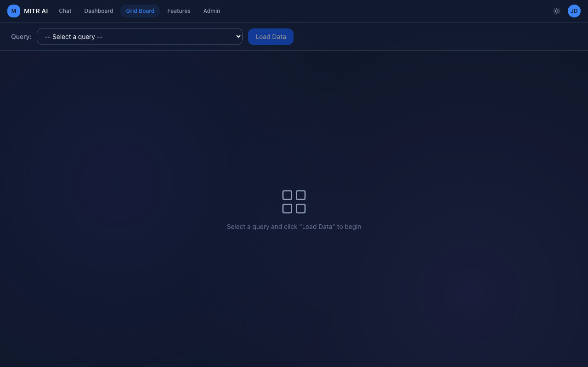

### GridBoard Overview

Once data is loaded, GridBoard shows a full spreadsheet-style view with filters, toolbar, and editable data grid.

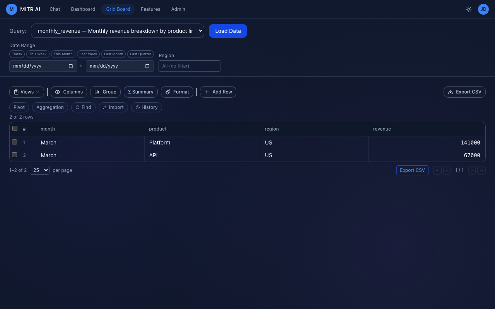

### Toolbar Operations

The toolbar provides powerful data operations:

| Tool            | What It Does                                                   |
| --------------- | -------------------------------------------------------------- |
| **Views**       | Save and switch between different column/filter configurations |
| **Columns**     | Show, hide, and reorder columns                                |
| **Group**       | Group rows by column values                                    |
| **Summary**     | Compute column-level aggregations                              |
| **Format**      | Apply number, date, and text formatting                        |
| **+ Add Row**   | Insert a new row                                               |
| **Export CSV**  | Download the current view as CSV                               |
| **Pivot**       | Create pivot table summaries                                   |
| **Aggregation** | Run column-level calculations                                  |
| **Find**        | Search within the data grid                                    |
| **Import**      | Import data from files                                         |
| **History**     | View change history                                            |

### Inline Editing

Double-click any cell to edit its value directly. Changes are tracked in the History panel.

### Filters

GridBoard shares the same filter system as Chat:

- **Date Range**: Select preset ranges or custom date ranges
- **Region**: Filter by geographic region
- Other query-specific filters appear automatically

### Inline Query Box

Below the data grid, a query input lets you run follow-up operations directly:

- "Sort, group, summarize cached data..."
- Supports the same follow-up chaining as Chat

---

## Flow 6: Widget — Embedded Chat

Learn how to use the chatbot as an embedded widget on any web page.

### How It Works

The widget provides the same chat functionality in a compact, embeddable format.

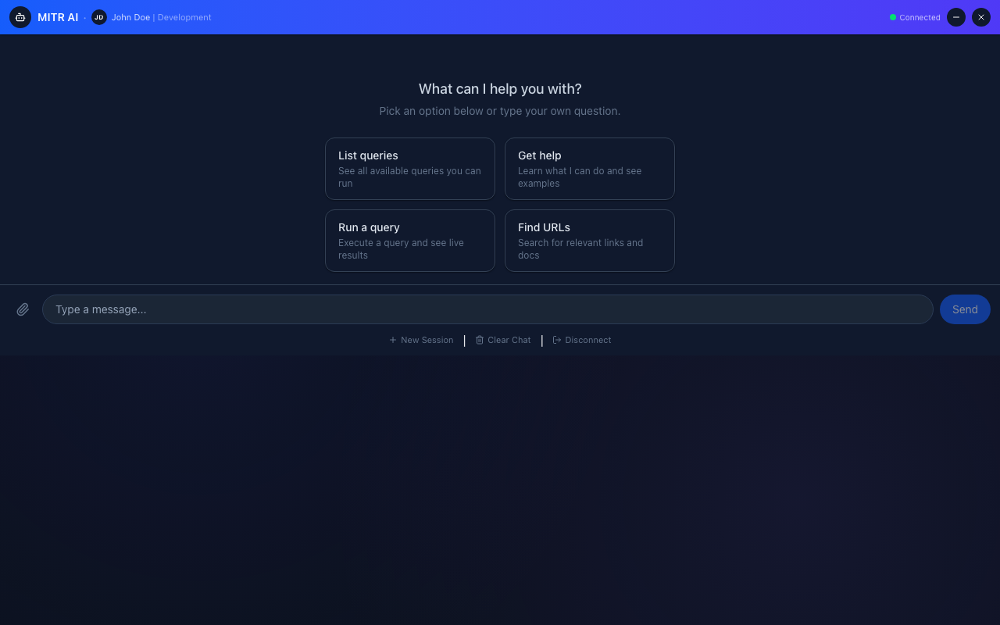

Key features:

1. Compact header showing user info and connection status
2. Same quick-start options as the full Chat page
3. Minimize and close buttons in the header
4. Full chat functionality — queries, filters, follow-ups, exports

### Widget on External Pages

When embedded on other websites, the widget appears as:

1. A circular bot icon in the bottom-right corner of the page
2. Click the icon to open the chat window
3. Type your questions in the message input
4. Click the icon again (or the X) to close

### Tips

- The widget remembers your conversation within the current session
- Click on suggested queries in the response to run them quickly
- Click on query cards in the "list queries" response to run that query directly
- All Chat features work in the widget: queries, filters, chaining, export, ML analysis

---

## Flow 7: Admin — Configure the Platform

Learn how to manage the platform settings, groups, and monitoring tools.

### Admin Overview

Navigate to **Admin** from the top navigation bar. The admin panel has a sidebar with all management and tools sections.

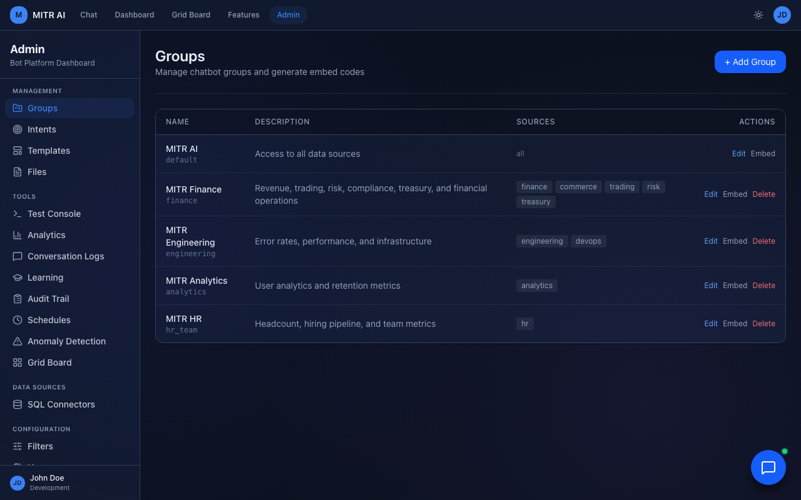

### Management Sections

| Section       | What It Does                                                     |
| ------------- | ---------------------------------------------------------------- |
| **Groups**    | Manage chatbot groups, assign data sources, generate embed codes |
| **Intents**   | Configure NLP intents and training utterances                    |
| **Templates** | Manage response templates                                        |
| **Files**     | Upload and manage CSV, XLSX, and document files                  |

### Tools Sections

| Tool                  | What It Does                                       |
| --------------------- | -------------------------------------------------- |
| **Test Console**      | Test chatbot responses in a sandboxed environment  |
| **Analytics**         | View usage analytics, query popularity, and trends |
| **Conversation Logs** | Browse and search historical conversations         |
| **Learning**          | Review ML learning data and signal strength        |
| **Audit Trail**       | Track all admin actions and changes                |
| **Schedules**         | Configure scheduled query refreshes                |
| **Anomaly Detection** | Configure anomaly thresholds and business rules    |

### Anomaly Detection Settings

Configure how the platform detects unusual patterns in query results:

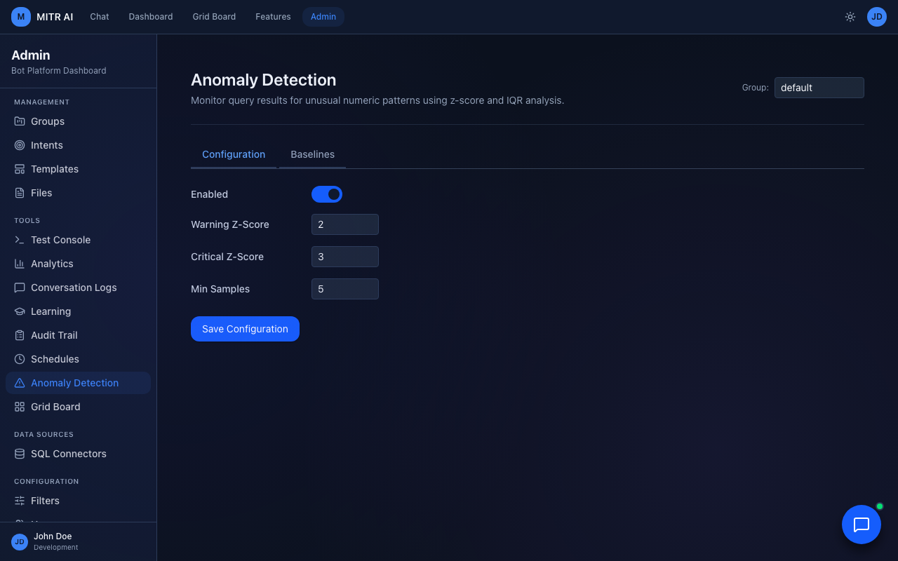

Settings:

- **Enabled** toggle: Turn anomaly detection on/off
- **Warning Z-Score**: Threshold for warning-level alerts (default: 2)
- **Critical Z-Score**: Threshold for critical-level alerts (default: 3)
- **Min Samples**: Minimum query executions before baselines are built (default: 5)
- **Baselines** tab: View and manage historical baselines per query

### Analytics Dashboard

View platform usage metrics and query trends:

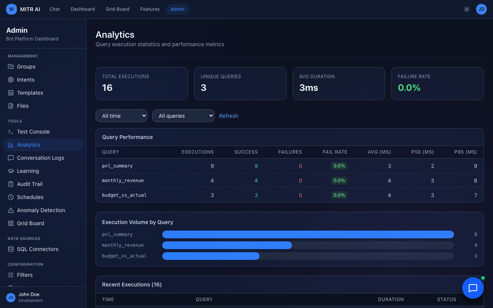

---

## Platform Features at a Glance

The Features page provides a visual overview of all platform capabilities:


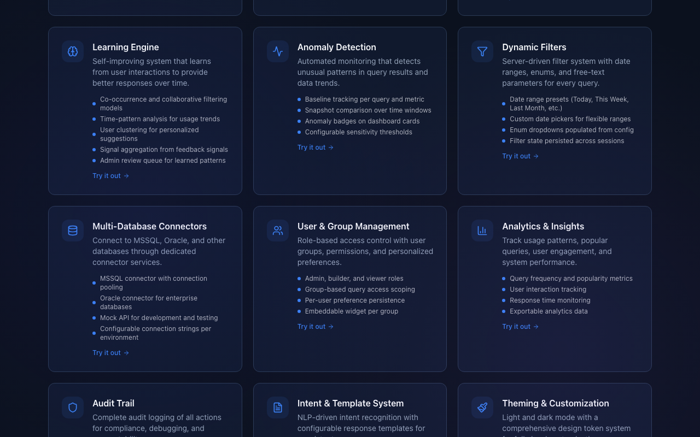

---

## Tips & Tricks

### Chat Tips

1. **Natural language works** — "How is performance looking?" works as well as "run performance"
2. **Aggregations on CSV data** — "what is the average salary in employee_metrics?"
3. **Multi-query comparison** — "compare error_rate and performance"
4. **Document search** — "what does the auth spec say about MFA?"
5. **Follow-up chains** — Chain group → sort → top-N, say "undo" to revert
6. **Conversational flow** — Say "yes"/"no" to confirm/decline, "what do you mean?" to clarify

### Dashboard Tips

7. **Favorites** — Star frequently-used queries for one-click access
8. **Semantic search** — Type naturally in the search bar
9. **Cross-surface flow** — "Pin to Dashboard" from Chat, or "Open in GridBoard"

### Data Tips

10. **CSV delimiter support** — Auto-detects comma, tab, semicolon, and pipe
11. **XLSX multi-sheet** — Each sheet becomes a separate query automatically
12. **Shared folder files** — Set `fileBaseDir` per query or `FILE_BASE_DIR` globally
13. **Date formatting** — All dates auto-formatted, no special syntax needed
14. **Large result handling** — Capped at 500 rows in Chat; use filters to narrow

### ML & Analysis Tips

15. **Smart suggestion chips** — Clickable, ranked by relevance and context
16. **Anomaly alerts** — Blue/yellow/red badges indicate unusual values
17. **ML analysis** — "find outliers", "show trend", "forecast ahead", "cluster the data", "PCA analysis"
18. **Export anywhere** — "export as CSV", "export as JSON", "export as Excel"
19. **SQL database queries** — Run by name, apply filters inline, view as tables with charts
